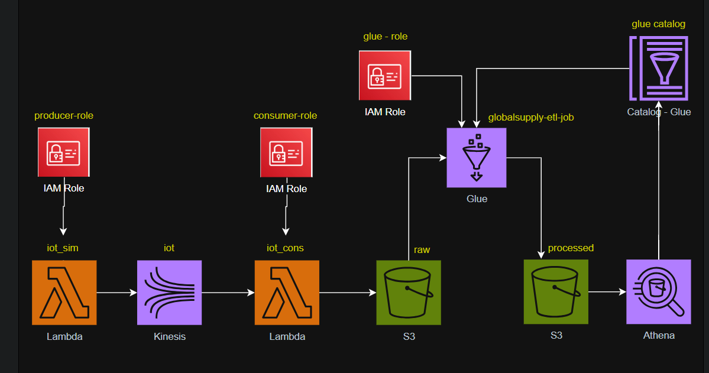
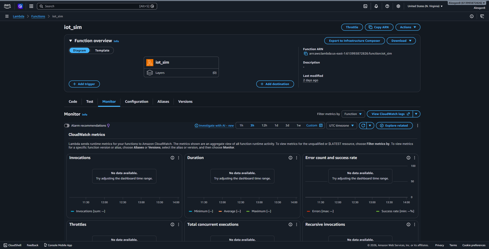
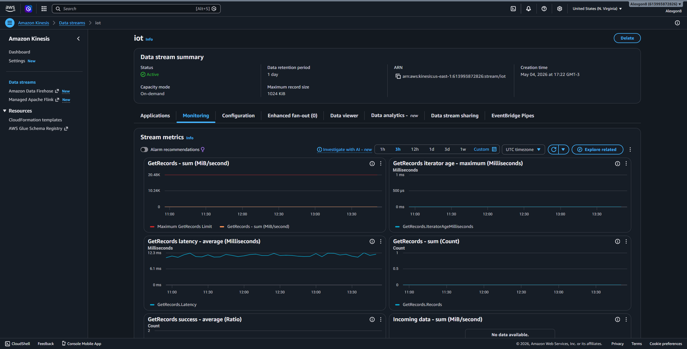
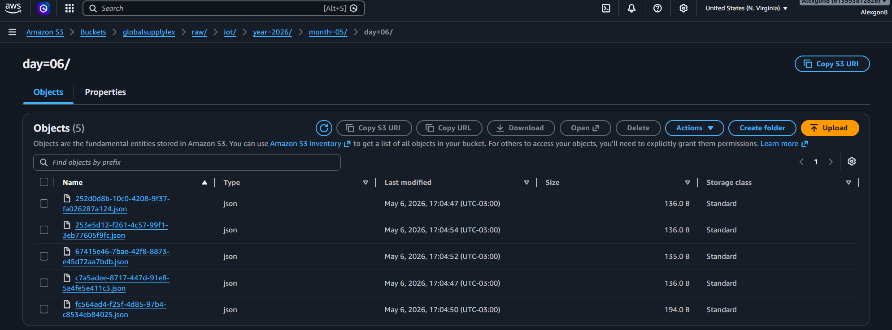
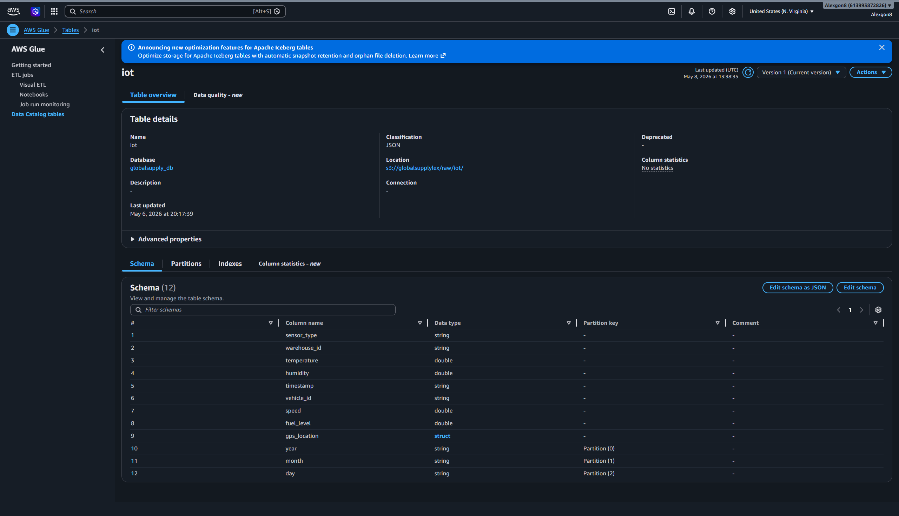
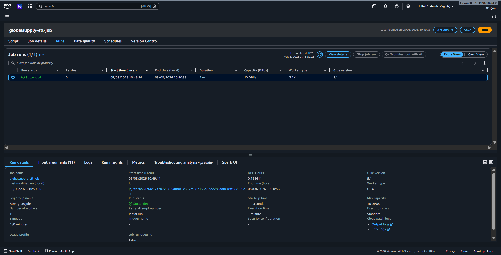
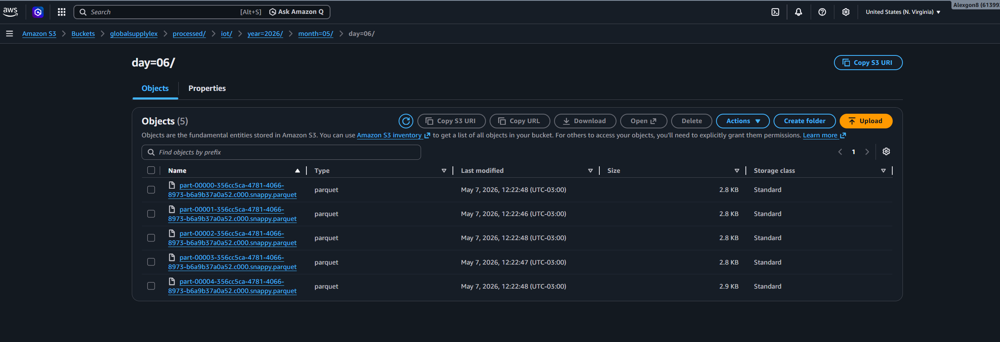
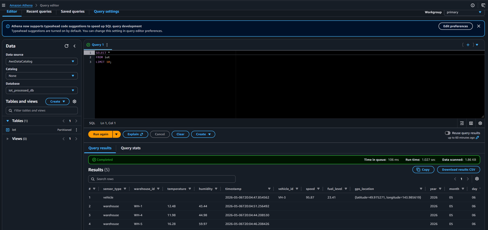

# 🚀 Pipeline de Dados em Streaming com AWS

Projeto prático desenvolvido com foco em Engenharia de Dados moderna, processamento em streaming, arquitetura de Data Lake e otimização analítica utilizando serviços AWS.

---

# 📸 Arquitetura da Solução



---

# 📌 Visão Geral

Este projeto apresenta a construção de um pipeline moderno de ingestão e processamento de dados em streaming utilizando serviços AWS.

A solução simula sensores IoT distribuídos em centros logísticos e veículos de transporte, enviando eventos em tempo real para um pipeline responsável por:

- ingestão streaming
- processamento orientado a eventos
- armazenamento em Data Lake
- transformação JSON → Parquet
- otimização analítica
- consultas serverless

Durante o desenvolvimento foram aplicados conceitos fundamentais de engenharia de dados moderna, incluindo:

- arquitetura orientada a eventos
- organização de Data Lake
- particionamento Hive-style
- processamento distribuído
- metadata catalog
- otimização de consultas analíticas

---

# 🏗️ Arquitetura do Pipeline

```plaintext
Lambda Producer
        ↓
Kinesis Data Streams
        ↓
Lambda Consumer
        ↓
S3 RAW (JSON)
        ↓
Glue Catalog + Glue ETL
        ↓
S3 Processed (Parquet)
        ↓
Athena
```

---

# ⚙️ Serviços AWS Utilizados

| Serviço | Objetivo |
|---|---|
| AWS Lambda | Simulação e consumo de eventos |
| Amazon Kinesis | Ingestão de dados em streaming |
| Amazon S3 | Armazenamento do Data Lake |
| AWS Glue | ETL e catálogo de metadados |
| AWS Glue Catalog | Descoberta e gerenciamento de schemas |
| Amazon Athena | Consulta analítica serverless |
| IAM Roles | Controle de permissões |

---

# 📸 Pipeline em Execução

## Lambda Producer enviando eventos para o Kinesis



---

## Stream criada no Amazon Kinesis



---

## Lambda Consumer processando eventos


---

## Estrutura RAW no Amazon S3



---

## Glue Catalog identificando schemas e partições



---

## Glue ETL convertendo JSON para Parquet



---

## Estrutura PROCESSED em Parquet



---

## Consultas analíticas no Athena



---

# 🗂️ Estrutura do Data Lake

## RAW Layer

Armazena dados brutos em formato JSON.

```plaintext
raw/iot/year=2026/month=05/day=06/
```

### Características

- dados imutáveis
- estrutura particionada
- base para auditoria e reprocessamento

---

## PROCESSED Layer

Armazena dados processados em formato Parquet.

```plaintext
processed/iot/year=2026/month=05/day=06/
```

### Características

- formato colunar
- compressão otimizada
- melhor performance analítica
- redução de custo no Athena

---

# 📈 Principais Aprendizados

Durante o desenvolvimento deste projeto foram trabalhados conceitos importantes de engenharia de dados moderna:

- Streaming de dados
- Event-driven pipelines
- Organização de Data Lake
- Particionamento Hive-style
- Conversão JSON para Parquet
- Metadata Catalog
- Processamento distribuído com Spark
- Consultas serverless com Athena
- Otimização de performance analítica
- Troubleshooting em pipelines streaming

---

# 🚀 Melhorias Futuras

Possíveis evoluções do projeto:

- Implementação de camada Curated/Gold
- Dashboards analíticos
- Integração com Databricks
- Data Quality
- Monitoramento com CloudWatch
- Automação de pipelines
- Streaming analytics em tempo real

---

# 📚 Tecnologias e Linguagens

- Python
- PySpark
- SQL
- AWS Lambda
- Amazon Kinesis
- Amazon S3
- AWS Glue
- Amazon Athena

---

# 👨‍💻 Autor

Alexandre Oliveira

Projeto desenvolvido com foco em evolução prática em Engenharia de Dados, arquitetura de Data Lake e construção de portfólio profissional.
